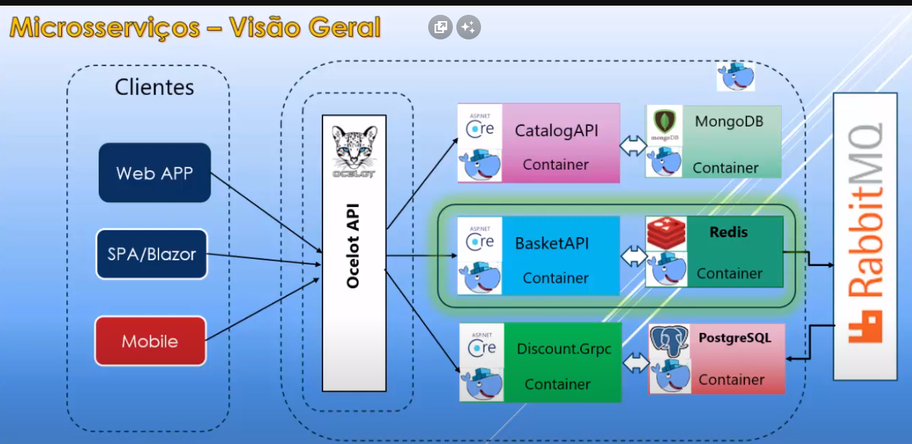
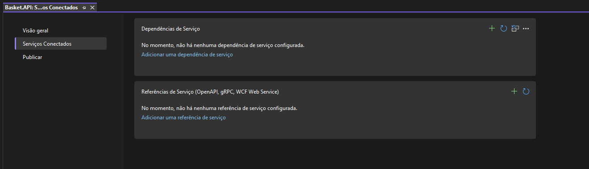
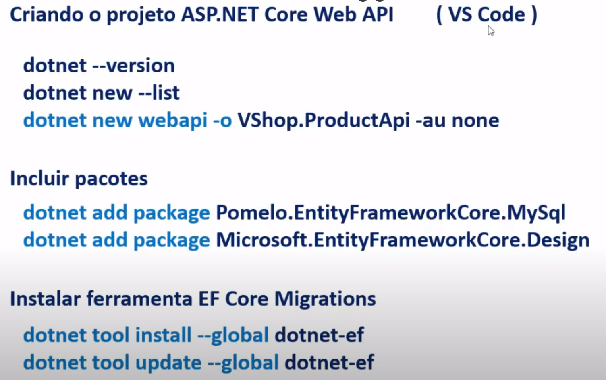

# Microsservicos-Macoratti

 

 - Estudo focado em estrutura de microserviço, não é um projeto completo com telas(FrontEnd) e CRUD completo.
 - Ficou faltando a parte do RabbitMQ e Ocelot, vou está estudando na 2° playlist de videos e postando em outro repositorio. 

 - Estudo e pesquisa sobre micros serviços com ASP.NET 7 Core e Docker!, o video não usa .NET 7 mas eu convertir usando a documentação.
.
 - Fonte da 1° playlist: https://www.youtube.com/watch?v=ubCvfws1m4A&t=139s

 - Fonte da 2° playlist: https://www.youtube.com/watch?v=jap8tXIAMi4&list=PLJ4k1IC8GhW1UtPi9nwwW9l4TwRLR9Nxg

 - "Instalando o Linux no windown"

<blockquete>

                wsl --install

</blockquete>

# Criando o projeto web api na pasta DemoMicrosservice

 - Para evitar erro, cria uma solução em branco, depois cria um projeto webapi como exemplo.

 - Quando for cria o projeto WebApi, seleciona a opção Dcoker para gerar o dockerfile sozinho.

<blockquete>

        dotnet new webapi -o DemoMicroservice --no-https

        cd DemoMicroservice

        code.

        dotnet run

        http://localhost:5000/weatherforecast

</blockquete>

# Docker
 
 - É uma plataforma que permite "criar, enviar e executar qualquer aplicativo, em qualquer lugar".

 - O objetivo do Docker é criar, testar e implementar aplicações em um ambiente separado da máquina original, chamado de contêiner, onde o desenvolvedor consegue empacotar sua aplicação de forma padrão com níveis de isolamento.

 ### Registry:

  - É um repositório de imagens Docker a partir de onde podemos obter imagens prontas para criar os nossos contêineres. https://hub.docker.com

 ### Host:

  - No Host temos a imagem que foi baixada do repositorio, ou criada por você, A partir dela criamos o processo que é o Contêiner Docker.

 ### Client:

  - O Client permite acessar o contêiner via linha de comando ou via API Remota. 

 ### Contêiner:

  - Um contêiner é uma unidade padrão de software que empacote o código e todas as suas dependências para que o aplicativo seja executado de maneira rápida e confiável de um ambiente de computação para outro.

 ### Imagens:

  - Imagens são modelos que são usados para criar contêineres e que contêm um sistema de arquivos com todos os arquivos que a aplicação no contêiner requer. Assim um contêiner é uma instância de uma imagem.

<blockquete>

        docker container run  

</blockquete>

 - Cria uma conta no site : https://hub.docker.com

 - Depois baixa o docker: https://www.docker.com/products/docker-desktop/

 - Instala o Docker e faz o login.

 ### Comandos docker

  - docker --version: informa a versão.
 
  - docker hellow-word: cria uma imagem para teste.

  - docker image ls : lista as imagens que você tem.

  - docker image rm "id da imagen": remove a imagem.

  - docker container rm "id da imagen": remove a imagem, (pode por um -f no final do comando para forçar).

  - docker container ls: lista os containes.

  - docker run: procura a imagem na maquina local -> não achando -> procura a imagem no docker Hub ->
 achando -> faz download da imagem -> instala na maquina local -> cira um novo container e inicia.

 ### Criando imagem docker

  - Criando um arquivo dockerfile: echo . > Dockerfile

  - O Docker cria imagens automaticamente lendo as instruções de um Dockerfile - um arquivo de texto que contém todos os comandos, em ordem, necessários para construir uma determinada imagem.

  - Exemplo de comandos que fica dentro do arquivo "dockerfile" que cria a imagem.

<blockquete>

        FROM mcr.microsoft.com/dotnet/sdk:7.0 AS build
        WORKDIR /src
        COPY DemoMicroservice.csproj .
        RUN dotnet restore
        COPY . .
        RUN dotnet publish -c release -o /app

        FROM mcr.microsoft.com/dotnet/aspnet:7.0
        WORKDIR /app
        COPY --from=build /app .
        ENTRYPOINT ["dotnet","DemoMicroservice.dll"]       

</blockquete>

 - FROM: Cria uma camada a partir da imagem do .net core sdk 7.0
 - WORKDIR: Define o diretório de trabalho de um contêiner do Docker a qualquer momento.
 - COPY: Adiciona arquivos do diretório atual do cliente do Docker.
 - RUN: Constrói sua aplicação com make.
 - CMD: Especifica qual comando deve ser executado no contêiner.
 - ENTRYPOINT: Informa ao Docker para configurar o contêiner para ser executado como um executável.

 ### Comando que executa o arquivo dockerfile

  - O comando docker build constroi uma imagem a partir de um Dockerfile e de um contexto.

<blockquete>

        docker build -t DemoMicroservice:0.1 -f DemoMicroservice/Dockerfile

</blockquete>

 - -t demomicroservice: Informa para marcar(ou nomear) a imagem como demomicroservice.

 - O parêmetro final(.): Informa qual diretorio usar para localizar o dockerfile(. define o diretorio atual).

 ### Criando um container

 - digita o comando "docker run", cria um nome para o container, e informa a porta, depois informa o nome da imagem.

<blockquete>

        docker run --name webcontainer -p 5000:80 demomicroservice:0.1
 
</blockquete>

# Docker sem o arquivo "dockerfile"

 - Cria a solução depois o projeto.

 - Digite o comando para instalar a extenção que vai fazer executar o docker sem arquivo dockerfile.

<blockquete>

                dotnet add package Microsoft.NET.Build.Containers
 
</blockquete>

 - No csproj, informa que foi adicionado o pacote.  

<blockquete>

                <ItemGroup>
                <PackageReference Include="Microsoft.NET.Build.Containers" Version="7.0.401" />
                </ItemGroup>
 
</blockquete>

 - Executa o comando que cria a imagem, usando esse pacote.

<blockquete>

                dotnet publish --os linux --arch x64 -p:PublishProfile=DefaultContainer
 
</blockquete>

 - Assim é criada a imagem.
 - Depois disso cria o container.

<blockquete>

                docker run --name testecontainer -p 5000:86 projeto01:1.0.0
 
</blockquete>

- Caminho do site: http://localhost:5000/weatherforecast

- No arquivo csproj, pode por a configuração dentro da tag "PropertyGroup", para reduzir o comando.

<blockquete>

                <PublishProfile>DefaultContainer</PublishProfile>
                <ContainerImageName>projeto01</ContainerImageName>
                <ContainerImageTag>1.0.0</ContainerImageTag>
 
</blockquete>

 - O comando que cria a imagem fica curto

<blockquete>

                dotnet publish --os linux --arch x64
 
</blockquete>

 - Pode definir a imagem base.

<blockquete>

                <ContainerBaseImage>mcr.microsoft.com/dotnet/aspnet:7.0-alpine</ContainerBaseImage>
 
</blockquete>

# NET - Criando Microsserviços : API Catalogo com MongoDB - I

 ### Objetivo:

 - Cria um API para um gerenciar produtos como um microsserviço

 ### Pré-requisitos: 
 
 - Noções de C#, ASP .NET Core e Docker

 ### Cenário:

 - Criar uma Asp.Net Core Web API.
 - Segindo o estilo REST(API REST).
 - Realizar consultas e operações CRUD em produtos.
 - Usar banco de dados NoSQL MongoDB em um contêiner Docker.
 - Usar o padrão repositório.
 - Conteinerizar a API com o MongoDB usando o Docker Compose.

 ### MongoDB

    SGBD relacional  | MongoDB 
 __________________________________ 
    Table            | Collection
    Row              | Document
    Column           | Field

 - Instala a extenção do mongoDB

<blockquete>

                MongoDB.Driver
 
</blockquete>

 ### Iniciando o projeto

 - Inciando a classe Product, criando configuração de conexao, inciaindo interface do contexto
 e implementando.

 - Cria a pasta "Entities" e a classe "Product".

<blockquete>

                public class Product
                {
                [BsonId]
                [BsonRepresentation(BsonType.ObjectId)]
                public string Id { get; set; }

                [BsonElement("Name")]
                public string Name { get; set; }
                public string Category { get; set; }
                public string Description { get; set; }
                public string Image { get; set; }
                public decimal Price { get; set; }

                }
 
</blockquete>

 - Cria uma pasta chamada "Data" e uma Interface chamada "ICatalogContext". 

<blockquete>

                public interface ICatalogContext
                {
                        IMongoCollection<Product> Products { get; }
                }
 
</blockquete>

 - Cria um classe chamada "CatalogContext" na pasta "Data" para implementar a interface.

 - Configurando a connection string, nome do banco, e nome da coleção(Tabela)

<blockquete>

        public class CatalogContext : ICatalogContext
        {
                public CatalogContext(IConfiguration configuration)
                {
                        // Configurando a conexionstring
                        var client = new MongoClient(configuration.GetValue<string>
                        ("DatabaseSettings:ConnectionString"));

                        // Nome do banco de dados
                        var database = client.GetDatabase(configuration.GetValue<string>
                        ("DatabaseSettings:DatabaseName"));

                        // Nome da coleção
                        Products = database.GetCollection<Product>(configuration.GetValue<string>
                        ("DatabaseSettings:CollectionName"));

                        //CatalogContextSeed.SeedData(Products);
                }

                public IMongoCollection<Product> Products { get; }
        }
 
</blockquete>

# NET - Criando Microsserviços : API Catalogo com MongoDB - II

 - Cria uma pasta chamada "Repositories", e um arquivo chamado "IProductRepository".

 - Task representa uma operação asyncrona.

<blockquete>

                public interface IProductRepository
                {

                Task<IEnumerable<Product>> GetProducts();
                        
                Task<Product> GetProduct(string id);

                Task<IEnumerable<Product>> GetProductByName(string name);

                Task<IEnumerable<Product>> GetProductByCategory(string categoryName);

                Task CreateProduct(Product product);
                Task<bool> UpdateProduct(Product product);
                Task<bool> DeleteProduct(string id);

                }
 
</blockquete>

 - Cria uma classe chamada "ProductRepository" para implementara interface "IProductRepository"

 - No construtor faz uma injeção dedependencia do contexto.

 - bota todos os metodos com o async.

 - faz a implementação usando await, e usando metodos async.

 - 

<blockquete>

                public class ProductRepository : IProductRepository
                {
                private readonly ICatalogContext _context;
                public ProductRepository(ICatalogContext context)
                {
                        _context = context;
                }

                public async Task CreateProduct(Product product)
                {
                        await _context.Products.InsertOneAsync(product);
                }

                public async Task<bool> DeleteProduct(string id)
                {
                        FilterDefinition<Product> filter = Builders<Product>.Filter.Eq(p => p.Id, id);

                        DeleteResult deleteResult = await _context.Products.DeleteOneAsync(filter);

                        return deleteResult.IsAcknowledged
                        && deleteResult.DeletedCount > 0;
                }

                public async Task<Product> GetProduct(string id)
                {
                        return await _context.Products.Find(p => p.Id == id).FirstOrDefaultAsync();
                }

                public async Task<IEnumerable<Product>> GetProductByCategory(string categoryName)
                {
                        FilterDefinition<Product> filter = Builders<Product>.Filter
                        .Eq(p => p.Category, categoryName);

                        return await _context.Products.Find(filter).ToListAsync();
                }

                public async Task<IEnumerable<Product>> GetProductByName(string name)
                {
                        FilterDefinition<Product> filter = Builders<Product>.Filter
                        .ElemMatch(p => p.Name, name);

                        return await _context.Products.Find(filter).ToListAsync();
                }

                public async Task<IEnumerable<Product>> GetProducts()
                {
                        return await _context.Products.Find(p => true).ToListAsync();
                }

                public async Task<bool> UpdateProduct(Product product)
                {
                        var updateResult = await _context.Products.ReplaceOneAsync(
                        filter: g => g.Id == product.Id, replacement: product);

                        return updateResult.IsAcknowledged
                        && updateResult.ModifiedCount > 0;
                }
        }
 
</blockquete>

 - No arquivo "appsettings", cria uma definição para a string de conexão para o MongoDB.

<blockquete>

                "DatabaseSettings": {
                "ConnectionString": "mongodb://localhost:27017",
                "DatabaseName": "CatalogDb",
                "CollectionName": "Products"    
                },

</blockquete>

 - No asp.net core 7 não tem a classe startup, então é usado a classe program.cs para por a configuração da injeção de dependencia.

 - No entanto criei um arquivo isolado para as configurações de injeção de dependencia.

<blockquete>

        namespace Catalogo.API.Configuration
        {
                public static class DependencyInjectionConfig
                {
                        public static IServiceCollection ResolveDependencies(this IServiceCollection services)
                        {

                        services.AddScoped<ICatalogContext, CatalogContext>();
                        services.AddScoped<IProductRepository, ProductRepository>();

                        return services;
                        }
                }
        }

</blockquete>

# NET - Criando Microsserviços : API Catalogo com MongoDB - III

 - Criando o CatalogController, um CRUD no controller.

 - Aplica a injeção de dependencia.

<blockquete>

        private readonly IProductRepository _repository;

        public CatalogController(IProductRepository repository)
        {
        _repository = repository ?? throw new ArgumentNullException(nameof(repository)); 
        }

</blockquete>

 - A classe "ControllerBase", fornece varios recursos para requisições HTTP:
  - BadRequest()
  - NotFound()
  - Ok()
  - TryUpdateModelAsync()
  - TryValidateModel()

 - O atributo "ApiController" fornece outros recursos como:
  - Valida o modelstate de modo automatico.
  - Faz a inferencia de parametros bind source.
  - Aciona automaticamente os erros de validação para o HTTP-400.
  - Não é obrigado a definir atributos como frombody, fromroot, fromforne, from service no corpo dos metodos action.

 - O atributo "[ ApiConventionTypeMatch(Type(DefaultApiConventions)) ] ":
   - Define os tipos de retornos e código status.

 - O atributo " [ ProducesResponseType ]" 
  - Define tipos de valor e código de status.
  - Ele fala que isso ja vem automatico mas mesmo assim usa. 

<blockquete>

        [HttpGet]
        [ProducesResponseType(typeof(IEnumerable<Product>), StatusCodes.Status200OK)]
        public async Task<ActionResult<IEnumerable<Product>>> GetProducts()
        {
        var products = await _repository.GetProducts();
        return Ok(products);
        }

</blockquete>

 - Buscando pelo id

<blockquete>

                [HttpGet("{id:length(24)}", Name = "GetProduct")]
                [ProducesResponseType(StatusCodes.Status404NotFound)]
                [ProducesResponseType(typeof(Product), StatusCodes.Status200OK)]
                public async Task<ActionResult<Product>> GetProductById(string id)
                {
                var product = await _repository.GetProduct(id);
                if(product is null)
                {
                        return NotFound();
                }
                return Ok(product);
                }

</blockquete>

 - Buscando pela categoria

<blockquete>

                [Route("[action]/{category}", Name = "GetProductByCategory")]
                [HttpGet]
                [ProducesResponseType(StatusCodes.Status400BadRequest)]
                [ProducesResponseType(StatusCodes.Status200OK, Type =  typeof(IEnumerable<Product>))]
                public async Task<ActionResult<Product>> GetProductByCategory(string category)
                {
                if (category is null)
                        return BadRequest("Invalid category");

                var product = await _repository.GetProductByCategory(category);
                
                return Ok(product);
                }

</blockquete>

 - Método que cria

<blockquete>

                [HttpPost]
                [ProducesResponseType(typeof(Product), StatusCodes.Status200OK)]
                [ProducesResponseType(StatusCodes.Status400BadRequest)]        
                public async Task<ActionResult<Product>> CreateProduct([FromBody] Product product)
                {
                if (product is null)
                        return BadRequest("Invalid product");

                await _repository.CreateProduct(product);

                return CreatedAtRoute("GetProduct", new {id = product.Id}, product);
                }

</blockquete>

 - Atualiza o valor, pode usar o "ProducesResponseType" ou o "ApiConventionMethod".

<blockquete>

                [HttpPut]
                [ProducesResponseType(typeof(Product), StatusCodes.Status200OK)]
                [ProducesResponseType(StatusCodes.Status400BadRequest)]
                //[ApiConventionMethod(typeof(DefaultApiConventions), nameof(DefaultApiConventions.Put))]
                public async Task<ActionResult<Product>> UpdateProduct([FromBody] Product product)
                {
                if (product is null)
                        return BadRequest("Invalid product");            

                return Ok(await _repository.UpdateProduct(product));
                }

</blockquete>

 - Metodo que deleta.

<blockquete>

                [HttpDelete("{id:lengeth(24)}", Name = "DeleteProduct")]
                [ProducesResponseType(typeof(Product), StatusCodes.Status200OK)]
                public async Task<IActionResult> DeleteProductById(string id)
                {
                return Ok(await _repository.DeleteProduct(id));
                }

</blockquete>

# NET - Criando Microsserviços : API Catalogo com MongoDB - IV

 ### Configurando Docker

  - Verificar o ambiente do Docker Desktop
  - Dashboard
  - Docker CLI (PowerShell)

<blockquete>

                docker --version
                docker images
                docker ps
                docker container ks -a
                docker volume ls
                docker network ls
                
</blockquete>

 ### Baixar imagem do mongo no Docker Hub.

<blockquete>

                docker pull mongo

</blockquete>

 ### Criar e executar o contêiner mongo. 
  - run: faz o download das imagens, cria, inicializa e executa o contêiner.
  - -d: indica o modo detached, que executa o contêiner em segundo plano.
  - -p 27017:27017 - compartilha a porta 27017 do contêiner com a mesma porta do host
  - name catalogo-mongo - define o nome do contêiner.
  - mongo -nome da imagem usada para criar o contêiner.

 OBS: poderia ter o nome container, mas ele ja entende que já é um container.
 
<blockquete>

                docker run -d -p 27017:27017 --name catalog-mongo mongo

</blockquete>

 - Alternativa

<blockquete>

                docker run -v ~/docker --name mongodb -p 27017:27017 -e MONGO_INITDB_ROOT_USERNAME=expertostech -e MONGO_INITDB_ROOT_PASSWORD=@mongo123 mongo

</blockquete>

 ### Entra no contêiner Mongo e executa alguns comandos.

  - exec -executa um comando em um contêniner em execução.
  - -it: aciona o modo iterativo e adiciona um terminal.
  - catalogo-mongo - define o nome do contêiner
  - /bin/bash - obtém um shell bash.

<blockquete>

                docker exec -it catalog-mongo /bin/bash

                mongo
                show dbs
                use ProductDb
                db.createCollection('Products')
                db.Products.insert ou db.Products.insertmany
                db.Products.remove({})

</blockquete>

 ### OBS: Deve se usado o "mongosh" é a forma mais atualizada.

 - https://www.mongodb.com/docs/mongodb-shell/install/

 - Baixar e configurar a variavel de ambiente.

<blockquete>

                docker exec -it catalog-mongo mongosh

</blockquete>

 - Comandos

<blockquete>
                 show dbs

                 // Cria banco
                 db.createCollection('Products')

                 //Cria tabela com valores.
                 db.Products.insert({"Name":"Caderno", "Category":"Material Escolar", "Image":"caderno.jpg", "Prince":7})

                 //Busca
                 db.Products.find({}).pretty()

                 // Remove
                 db.Products.remove({})

</blockquete>

 ### Adicionando docker na aplicação

 - Clica com botão direito no projeto, e escolhe, Add, depois dcoker support.

  - "Docker support" para gerar arquivo "Dockerfile".
  - "Container Orchesttrator support" para gerar o "Docker-Compose".

 ### Dockerfile
  
  - O Docker cria imagens automaticamente lendo as instruções de um Dockerfile - um arquivo de texto que contém todos os comandos, em ordem, necessários para construir uma determinada imagem. 

  - Criar imagem da aplicação ASP.NET Core Web, o ponto no final define o diretorio atual. 
 
<blockquete>

                docker build -t <nome_imagem> .

</blockquete>

 - Cria o container a partir da imagem

<blockquete>

                dcoker run <nome_container> <nome_image>

</blockquete>

# .NET - Criando Microsserviços : API Catalogo com MongoDB - V

 - Orquestração com docker-compose.

 ### Docker compose

 - É uma ferramenta usada para descrever aplicações complexas e gerenciar contêineres, redes e volumes que essa aplicações exigem para funcionar.

 - Usa um arquivo no formato YAML(extensão.yml) para configurar os serviços das aplicações.

 - Com um único comando podemos criar e inicializar todos os serviços a partir desta configuração.

 - Simplifica o processo de configuração e execução de aplicativos para que não tenhamos que digitar comandos complexos, o que pode levar a erros de configuração.

 - docker-compose.yml

<blockquete>

                version:  "3.4"
                services: Indica os serviços que serão criados Aqui definimos os contêineres usados e suasconfigurações.
                volumes: Define os recrusos usados pelos serviços.
                networks: Define os recrusos usados pelos serviços.

</blockquete>

 - docker-compose: processa o arquivo de composição.
 - -f : especifica o nome do arquivo de composição.
 - build : informa ao Docker para processar o arquivo.

<blockquete>

                docker-compose -f docker-compose.yml build

</blockquete>

 - Outros comandos do docker compose.

<blockquete>4:54

                docker-compose up -d : cria as imagens e executa os contêineres.
                docker-compose build : cria as imagens.
                docker-compose images : lista as imagens.
                docker-compose stop : para os contêineres.
                docker-compose run : executa os contêineres.
                docker-compose down : para os serviços, e limpa os contêineres, redes e imagens.

</blockquete>

 - Gerar de forma automatica, usando o  visual studio 2019

 - Opcao `Container Orchestrator Support`

  - Criar o arquivo DockerFile no projeto.
  - Criar o projeto docker-compose (docker-compose.dcproj)
   - dockerignore
   - docker-compose.yml
   - docker-compose.override.yml(complementa os substitui as configuracoes.)

- arquivo do `docker-compose.ylm`, foi adicionado informacoes do mongo e volumes

<blockquete>

                version: '3.4'

                services:
                  catalogdb:
                    image: mongo

                  catalogo.api:
                    image: ${DOCKER_REGISTRY-}catalogoapi
                    build:
                      context: .
                      dockerfile: Catalogo.API/Dockerfile

                volumes:
                  mongo_data:

</blockquete>

 - docker-compose.override.yml

 - Cria um container pro catalogodb.
 - Sempre restart.
 - Define o mapeamento das portas.
 - Mapea o volume.
 - Na Api, define o ambiente que está trabalhando.
 - Sobreescreva a DatabaseSettings!

<blockquete>

version: '3.4'

services:  
  catalogdb:
    container_name: catalogdb
    restart: always
    ports:
      - "27017:27017"
    volumes:
      - mongo_data:/data/db 

  catalogo.api:
    container_name: catalog.api
    environment:
      - ASPNETCORE_ENVIRONMENT=Development
      - "DatabaseSettings:ConnectionString=mongodb://catalogdb:27017"
      - "DatabaseSettings__ConnectionString=mongodb://catalogdb:27017"
    depends_on:
     - catalogdb
    ports:
      - "8000:80"

</blockquete>

 - É importante sobreescrever, porq não existe mais o localhost, e sim a DatabaseSettings do docker.

 ### Executando manualmente

<blockquete>

                docker-compose -f docker-compose.yml -f docker-compose.override.yml up -d

</blockquete>

 - Antes de usar é sempre bom limpar primeiro o ambiente usando o comando o dashborard, pausa e deleta os container, depois seleciona todas as imagens e deleta.

 - limpa também os volumes

<blockquete>

                docker volume rm $(docker volume ls q)

</blockquete>

# .NET - Criando Microsserviços : API Basket com Redis - VI

 ### Criando outro projeto de API

  - Basket.API, usando .NET core e docker.
  - Redis e Docker na parte do Banco.

 ### Objetivo

  - Obter a cesta e os itens com o usuário.
  - Atializar a cesta e os itens(inclui/remove item)
  - Deletar a cesta
  - Fazer o checkout da cesta

  - GET, POST, DELETE, POST(Checkout): publica na fila Rabbitmq usando o Masstransit.
  - ASP.NET Core Web API usando princípios REST, realiza operações CRUD com padrão Repository usando o Redis como meio de armazenamento com cache distribuído.

  - Pesquisar depois, em outros videos do Macorati sobre Rabbitmq e Masstransit.

 ### Redis

  - Pode ser usado como chache distribuido ou mensagenria.

   - DataStore na memória.
   - Estruturas flexiveis de dados.
   - Simplicidade e facilidade de uso.
   - Replicação e persistência.
   - Alta disponibilidade e escalabilidade.
   - Extensibilidade.
   - Suporte a linguagens.

 - Funções

  - Todos os dados residem na memória.
  - Oferece uma grande variedade de estruturas.
  - Reduz a qualidade de código necessária.
  - Oferece suporte á replicação assíncrona.
  - Cria soluções altamente disponíveis.
  - Projeto de código aberto extensível.
  - Funciona em varias lingagens de programação.

 ### Criando o container Redis.

  - Comandos, de como criar container e depois entrar dentro do Redis para manipular.

<blockquete>

                docker run --name local-redis -p 6379:6379 -d redis

                docker exec -it local-redis sh

                #redis-cli

</blockquete>

 - Para ver logs

<blockquete>

                docker logs local-redis

</blockquete>

 - Comandos depois de executar o "#redis-cli".

<blockquete>

                set name bem-vindo
                get name
                ping
                incr contador
                get contador

</blockquete>

 ### Porque usar o Redis

 - Ele é um chace distribuido, usado para um carrinho de compra, são dados temporarios.

 - Usuario faz um request e realizando uma operação envolvendo a cesta de compras.
 - A API verifica se o item esta no cache, se não estiver coloca o item no cache e assim ele poderá ser acessado no próximo request.
 - O recurso é retornado para o usuário  a partir do cache ou de outra fonte.
 
 ### Criando o projeto Basket.api

 - Cria um projeto web API, cria uma entidade chamada "ShoppingCart", "BasketCheckout" e "ShoppingCartItem"

# .NET - Criando Microsserviços : API Basket com Redis - VII

 - Configurar a integração do Redis com a API

 - IDistributedCache: implementa os metodos do Redis.

  - Get, GetAsync: Aceita uma chave do tipo string e recupera um item em cache como um array de bytes, se existir.
  - Set, SetAsync: Adiciona um item (como um array de bytes) ao cache usando uma chave string.
  - Refresh, RefreshAsync: Atualiza um item no cache com base em sua chave, redefinindo seu tempo limite de expiração deslizante(se houver).
  - Remove, RemoveAsync: Remove um item de cache com base em sua chave de cadeira de caracteres.

  ### Instalação do Redis

<blockquete>

                Package Manager - Install-Package Microsoft.Extensions.Caching.StackExchangeRedis

                NET CLI - dotnet add package Microsoft.Extensions.Caching.StackExchangeRedis

</blockquete>

 - Configurar no método ConfigureServices da classe Startup a porta do redis disponível

<blockquete>

                services.AddStackExchangeRedisCache(options =>
                {
                        //options.Configuration = "localhost:6379";

                        var teste = builder.Configuration.GetValue<string>("CacheSettings:ConnectionString");
                        options.Configuration = teste;
                });

</blockquete>

 - No arquivo appSettings, bota a configuração.

<blockquete>

                {
                        "CacheSettings": {
                        "ConnectionString": "localhost:6379"
                        }
                }

</blockquete>

 - Cria a interface "IBasketRepository" na pasta repositories, depois cria a classe "BasketRepository", e o controle "BasketRepositoryController".

<blockquete>

                public interface IBasketRepository
                {
                        Task<ShoppingCart> GetBasket(string userName);
                        Task<ShoppingCart> UpdateBasket(ShoppingCart basket);
                        Task DeleteBasket(string userName);
                }

</blockquete>

 - Implementando a interface.

 - Retorna Task porque são metodos async.

 ### ATENÇÃO: O metodo "_redisCache.GetStringAsync(userName);" retorna um array de bitys, por isso deve ser usado o "JsonSerializer.Deserialize< ShoppingCart>(basket);"

 ### Para salvar deve Serializar porque o Redis trabalha com array de bytes.

<blockquete>

                public class BasketRepository : IBasketRepository
                {
                        // Está incluida no pacote.
                        private readonly IDistributedCache _redisCache;

                        public BasketRepository(IDistributedCache redisCache)
                        {
                                _redisCache = redisCache ?? throw new ArgumentNullException(nameof(redisCache));
                        }

                        public async Task<ShoppingCart?> GetBasket(string userName)
                        {
                                var basket = await _redisCache.GetStringAsync(userName);

                                if(string.IsNullOrEmpty(basket))
                                {
                                return null;
                                }

                                return JsonSerializer.Deserialize<ShoppingCart>(basket);
                        }

                        public async Task<ShoppingCart> UpdateBasket(ShoppingCart basket)
                        {
                        //serializar porque rediz trabalha com array de bytes.
                        await _redisCache.SetStringAsync(basket.UserName, JsonSerializer.Serialize(basket));

                        return await GetBasket(basket.UserName);
                        }

                        public async Task DeleteBasket(string userName)
                        {
                                await _redisCache.RemoveAsync(userName);
                        }
                }
               
</blockquete>

 - Cria a variavel que faz referencia ao repositorio, classe que implementa a interface.

 - Para depois criar o contrutor com o botão direito do mouse, escolhando a validação de null

 - Se for null ele cria uma cesta vazia com o nome do usuario.

<blockquete>

                        [Route("api/v1/[controller]")]
                        [ApiController]
                        public class BasketController : ControllerBase
                        {
                                private readonly IBasketRepository _repository;

                                public BasketController(IBasketRepository repository)
                                {
                                        _repository = repository ?? throw new ArgumentNullException(nameof(repository));
                                }

                                [HttpGet("{userName}", Name = "GetBasket")]
                                public async Task<ActionResult<ShoppingCart>> GetBasket(string userName)
                                {
                                        var basket = await _repository.GetBasket(userName);

                                        return Ok(basket ?? new ShoppingCart(userName));
                                }

                                [HttpPut]
                                public async Task<ActionResult<ShoppingCart>> UpdateBasket([FromBody] ShoppingCart basket)
                                {
                                        return Ok(await _repository.UpdateBasket(basket));
                                }

                                [HttpDelete]
                                public async Task<IActionResult> DeleteBasket(string userName)
                                {
                                        await _repository.DeleteBasket(userName);
                                        return Ok();
                                }
                        }

</blockquete>

 - Na classe program aplica a injeção de dependencia

<blockquete>

                        builder.Services.AddScoped<IBasketRepository, BasketRepository>();

</blockquete>

# .NET - Criando Microsserviços : API Basket com Redis - VIII

 - Levanta o container do redis.

<blockquete>

                docker run --name local-redis -p 6379:6379 -d redis

                docker ps -a

</blockquete>
 
 - 5213
 - Executando a API e o redis corretamente.

 ### Criando um container para a API e para o redis.

 - docker stop local-redis
 - docker rm local-redis

 - Para e remove para poder orquestrar tudo.
 - vai na API basket depois ADD, "Container Orchestrator Support", docker compose, linux, depois de carregar ele cria o dockerfile e configura o docker-compose.

 - coloca o nome do container.
 - defica a conexão do redis.

<blockquete>

  basket.api:
    container_name: basket.api
    environment:
      - ASPNETCORE_ENVIRONMENT=Development
      - "CacheSettings:ConnectionString=basketdb:6379" 
    ports:
      - "8001:80"

</blockquete>

 - configura o docker-compose, colocando um serviço

<blockquete>

                basketdb:
                   image: redis:alpine

</blockquete>

 - Configura o serviço no overrrayd

<blockquete>

basketdb:
  container_name: basketdb
  restart: always
  ports:
    - "6379:6379"

</blockquete>

 - Comando para orquestrar.

<blockquete>

                docker-compose -f docker-compose.yml -f docker-compose.override.yml up -d

</blockquete>

# .NET - Criando Microsserviços : API Discount com PostgreSQL - IX

 - Essa 3° API, usa ASP.NET Core, PostGreSQL Npgsql( vamos usar o pgAdm, ferramenta o postgreSql), Dapper ORM,

 - API que calcula os descontos. 

 - Comando que cria a tabela no banco, no banco DiscountDb.

<blockquete>

                CREATE TABLE Coupon(
                        ID SERIAL PRIMARY KEY NOT NULL,
                        ProductName VARCHAR(24) NET NULL,
                        Description TEXT,
                        Amount INT
                )

</blockquete>

 - Classe principal.

<blockquete>

                        Public Class Coupon
                        {
                                public int Id {get; set;}
                                public string ProductName {get; set;}
                                public string Description {get; set;}
                                public int Amount {get; set;}
                        }

</blockquete>

 - Pacotes usado no projeto

<blockquete>

                Install-Package Npgsql.
                Install-Package Dapper.

</blockquete>

 - Cria a classe "DiscountRepository" e a interface "IDiscountRepository".

 - Gera o construtor automatico com o botão direto do mouse, mas antes bota a propriedade "_configuration".

 - Pode extrair o metodo com o botão direito do mouse.
 
<blockquete>

                public interface IDiscountRepository
                {
                        Task<Coupon> GetDiscount(string productName);
                        Task<bool> CreateDiscount(Coupon coupon);
                        Task<bool> UpdateDiscount(Coupon coupon);
                        Task<bool> DeleteDiscount(string productName);
                }

</blockquete>
 
<blockquete>
                public class DiscountRepository : IDiscountRepository
                {
                        private readonly IConfiguration _configuration;

                        public DiscountRepository(IConfiguration configuration)
                        {
                                _configuration = configuration ?? throw new ArgumentNullException(nameof(configuration));
                        }

                        private NpgsqlConnection GetConnectionPostgreSQL()
                        {
                                return new NpgsqlConnection(
                                                _configuration.GetValue<string>("DatabaseSettings:ConnectionString"));
                        }

                        public async Task<Coupon> GetDiscount(string productName)
                        {
                                NpgsqlConnection connection = GetConnectionPostgreSQL();

                                var coupon = await connection.QueryFirstOrDefaultAsync<Coupon>
                                ("SELECT * FROM Coupon WHERE ProductName = @ProductName", 
                                new {productName = productName});

                                if(coupon == null) 
                                {
                                return new Coupon
                                {
                                        ProductName = "No Discount",
                                        Amount = 0,
                                        Description = "No Discount Desc"
                                };
                                }

                                return coupon;

                        }
                        
                        public async Task<bool> CreateDiscount(Coupon coupon)
                        {
                                NpgsqlConnection connection = GetConnectionPostgreSQL();

                                var affected = await connection.ExecuteAsync
                                ("INSERT INTO Coupon (ProductName, Description, Amount)" +
                                " VALUES (@ProductName, @Description, @Amount)",
                                new
                                {
                                        ProductName = coupon.ProductName,
                                        Description = coupon.Description,
                                        Amount = coupon.Amount
                                });

                                if(affected == 0)
                                {
                                return false;
                                }

                                return true;
                        }            

                        public async Task<bool> UpdateDiscount(Coupon coupon)
                        {
                                NpgsqlConnection connection = GetConnectionPostgreSQL();

                                var affected = await connection.ExecuteAsync
                                ("UPDATE Coupon SET ProductName=@ProductName, Description = @Description," +
                                " Amount = @Amount WHERE Id = @Id",
                                new
                                {
                                        ProductName = coupon.ProductName,
                                        Description = coupon.Description,
                                        Amount = coupon.Amount,
                                        Id = coupon.Id
                                });

                                if (affected == 0)
                                {
                                return false;
                                }

                                return true;
                        }

                        public async Task<bool> DeleteDiscount(string productName)
                        {
                                NpgsqlConnection connection = GetConnectionPostgreSQL();

                                var affected = await connection.ExecuteAsync
                                ("DELETE FROM Coupon WHERE ProductName" +
                                " = @ProductName",
                                new
                                {
                                        ProductName = productName                   
                                });

                                if (affected == 0)
                                {
                                return false;
                                }

                                return true;
                        }

                }
</blockquete>

 - Configuração da ConnectionString.

<blockquete>

        "DatabaseSettings": {
                "ConnectionString":"Server=localhost;Port=5432;Database=DiscountDb;User Id=admin;Password=admin1234;"
        },

</blockquete>

 - Cria o controle, e bota a propriedade "IDiscountRepository", cria o controlador usando o botão direito do mouse.
 
<blockquete>

                [Route("api/v1/[controller]")]
                [ApiController]
                public class DiscountController : ControllerBase
                {
                        private readonly IDiscountRepository _repository;

                        public DiscountController(IDiscountRepository repository)
                        {
                                _repository = repository ?? throw new ArgumentNullException(nameof(repository));
                        }

                        [HttpGet("{productName}", Name = "GetDiscount")]
                        public async Task<ActionResult<Coupon>> GetDiscount(string productName)
                        {
                                var coupon = await _repository.GetDiscount(productName);
                                return Ok(coupon);
                        }

                        [HttpPost]        
                        public async Task<ActionResult<Coupon>> CreateDiscount([FromBody] Coupon coupon)
                        {
                                //if (coupon is null)
                                //    return badrequest("invalid coupon");

                                await _repository.CreateDiscount(coupon);
                                return CreatedAtRoute("GetDiscount", new { productName = coupon.ProductName }, coupon);
                        }

                        [HttpPut]
                        public async Task<ActionResult<Coupon>> UpdateDiscount([FromBody] Coupon coupon)
                        {
                                return Ok(await _repository.UpdateDiscount(coupon));
                        }

                        [HttpDelete("{productName}", Name = "DeleteDiscount")]        
                        public async Task<ActionResult<bool>> DeleteDiscount(string productName)
                        {
                                return Ok(await _repository.DeleteDiscount(productName));
                        }
                }

</blockquete>

 - depois configura na classe Program a Injeção de dependencia

<blockquete>

                builder.Services.AddScoped<IDiscountRepository, DiscountRepository>();

</blockquete>

# .NET - Criando Microsserviços : API Discount com PostgreSQL - X

 - Cria o dockerfile, da um add na api, escolhe "suporte docker orquestrator".
 - Ele atualiza o dockercompose.
 - No arquivo dockerfile, cada FROM é um estagio diferente, e AS da nome a esse estagio.
 - COPY faz copia de arquivos das etapas anteriores.
 - No arquivo docker compose tem 4 fazes:
  - Base: baixa a imagem do aspnet, WORKDIR é o nome do diretorio do trabalho do container, EXPOSE é a porta.
  - build: executa o dotnet build.
  - publish: publica a aplicação.
  - final: copia o que foi gerado para a pasta de publish, executa a aplicação no container.

 ### Ajustes no docker-compose.

  - Cria 2 serviços/imagen, postgre e pgAdmin.

  - Documentação do postgre, explicando sobre a variavel de ambiente.
  - https://hub.docker.com/_/postgres

  - O volume do docker ele fica fora do container, podendo destruir os container, sem destruir os dados.
  - Cria 2 volumes

<blockquete>

        services:
          discountdb:
            image: postgres

          pgadmin:
            image: dpage/pgadmin4

        volumes:
          mongo_data:
          postgres_data:
          pgadmin_data:

</blockquete>

 ### Ajuste no docker-compose.override.yml

 - inclui novas informações.

<blockquete>

                discountdb:
                  container_name: discountdb
                  environment:
                    - POSTGRES_USER=admin
                    - POSTGRES_PASSWORD=admin1234
                    - POSTGRES_DB=DiscountDb
                  restart: always
                  ports:
                    - "5432:5432"
                  volumes:
                    - postgres_data:/var/lib/postgresql/data

                discount.api:
                  container_name: discount.api
                  environment:
                    - ASPNETCORE_ENVIRONMENT=Development
                    - "DatabaseSettings:ConnectionString=Server=discountdb;Port=5432;Database=DiscountDb;User Id=admin;Password=admin1234;"
                  depends_on:
                    - discountdb
                  ports:
                    - "8002:80"

                pgadmin:
                  container_name: pgadmin
                  environment:
                    - PGADMIN_DEFAULT_EMAIL=admin@macoratti.com
                    - PGADMIN_DEFAULT_PASSWORD=admin1234
                  restart: always
                  ports:
                    - "5050:80"
                  volumes:
                    - pgadmin_data:/root/.pgadmin

</blockquete>

 - executando as imagens, cria os volumes.(OBS: dei um "docker-compose build" antes)

<blockquete>

                docker-compose -f docker-compose.yml -f docker-compose.override.yml up -d

</blockquete>

 - entra no pgadmin, http://localhost:5050/browser/, loga usando os valores de usuario que foi definido no docker
 
<blockquete>

</blockquete>

 - Entra no "http://localhost:5050/browser/" para acessar o banco.
 - admin@macorati.com
 - admin1234
        - add new server
                - Name: DiscountServer
                - Aba Connection: Host name: discountdb, username: admin, senha:admin1234

 - No banco discountdb.
 - codigo que cria a tabela

<blockquete>

                CREATE TABLE Coupon(
                        Id SERIAL PRIMARY KEY,
                        ProductName VARCHAR(24) NOT NULL,
                        Description TEXT,
                        Amount INT
                );

</blockquete>

 - Codigo que inseri os dados.

<blockquete>

                INSERT INTO Coupon(ProductName, Description, Amount)
                VALUES('Caderno', 'Caderno Espiral'. 5);

</blockquete>

# .NET - Criando Microsserviços : API Discount com gRPC - XI (Cria projeto gRPC)

 - Comunicação entre microserviço, gRPC é um outra alternativa alem do Rest full.

 - A API Discount vai virar Grpc.

 - É uma arquitetura RPC DE código aberto criada pelo Google para obter uma comunicação de alta velocidade entre microsserviço que permite a integração de serviços programados em diferentes linguagens.

 - Usa o formato de mensagem protobuf(buffers de protocolo), que fornecem um formato de serialização altamente eficiente e com neutralidade de plataforma para serializar mensagens estruturadas que os serviços enviam entre si.

 - Oferece suporte abrangente entre as pilhas de desenvolvimento mais populares, incluindo Java, JavaScript, C#, go, Swift e NodeJS.

 - As APIs baseadas em RPC são ótimas para ações ou seja, pricedimentos ou comandos podendo ser uma alternativa mais eficiente do que as APIs REST.

 ### Diferença entre APIs REST e gRPC:

  - Formato de mensagem Protobuf(em vez de JSON / XML)
  - Construido em HTTP2(comunicação bidirecional, mas rapido) em vez de HTTP1.1
  - Geração de código nativo em vez de usar ferramentas de terceiros.
  - Transmissão de mensagens muitas vezes mais rápida.
  - Implementação mais lenta do que REST.

 ### OBS: O gRPC ainda não foi amplamente adotado e a maioria das ferramentas de terceiros continua sem recursos integrados para compatibilidade de gRPC.

 ### Como usar o gRPC na plataforma .NET

  - A integração do gRPC com a plataforma .NET foi feita na versão 3.0 do .NET Core SDK.
  - O SDK inclui ferramentas para roteamento de endpoint, IoC interno e registro em log.
  - O servidor Web Kestrel de código aberto dá suporte a conexões HTTP/2.

  - O Visual Studio 2019 versão 16.3 ou superior(com carga de trabalho de desenvolvimento web instalada)
  - Visual Studio Code
  - Ferramenta de linha de comando: CLI do dotnet.

 ### Cria um projeto do tipo gRPC na solução.

  - Na pasta Protos, tem os arquivos greet.proto, que são contratos, que são mensagem de clientes e servidor, nesse arquivo tem a definição dos serviços, deve está no cliente e no servidor.

  - Na pasta services, fica os serviços, que tem varios recursos como a injeção de dependencia, registro, logger, autenticação autorização, ela implementa o arquivo "proto".

  - Na classe program, tem uma configuração propria para o Grpc.

  - No arquivo appsettings.json tem a indicação da configuração Kestrel para o Http2.

  - Removeu o http do gRPC: https://localhost:7237;http://localhost:5111

  - o http foi alterado para : http://localhost:5003

# .NET - Criando Microsserviços : API Discount com gRPC - XII (Copia a entity e repositorio, e cria o arquivo proto)

 - Instalar os pacotes Neget para o PostgreSQL e Dapper.
 - Copiar a pasta Entities e a classe Coupon(alterar o namespace)
 - Copiar a pasta Respeitories e as suas classes(alterar o namespace)
 - Copiar a ConnectionString para o arquivo appsettings.json
 - Registrar o serviço para o repositório na classe Startup.

 ### Doc

 - https://protobuf.dev/programming-guides/proto3/

 ### Instala lib

  - Dapper
  - Npgsql  

 ### Copia as pasta do Discount.API para o Discount.gRPC

  - Copia a pasta Entities, e troca o nameespace.
  - Faz o mesmo com a pasta Repositorio.
  - Na classe program copia e cola a configuração da injeção de dependencia no projeto gRPC

<blockquete>

                builder.Services.AddScoped<IDiscountRepository, DiscountRepository>();

</blockquete>

 - Copia e cola a configuração da ConnectionString no arquivo appSettings.

<blockquete>

                "DatabaseSettings": {
                "ConnectionString": "Server=localhost;Port=5432;Database=DiscountDb;User Id=admin;Password=admin1234;"
                },

</blockquete>

 ### Criar arquivos Proto e gerar as classes de serviço.

  - Deleta o arquivo modelo da pasta protos e services.
  - Comenta o mapeamento para o serviço no método configure da classe starup.
  - Criar o arquivo Discount.proto na pasta Protos.
  - Definir o serviço e as mensagens para realizar o CRUD.
  - Ferar o código do servidor a partir do arquivo proto.

 - Cria um arquivo do tipo proto.
 
<blockquete>

                        syntax = "proto3";

                        option csharp_namespace = "Discount.Grpc.Protos";

                        service DiscountProtoService{
                                rpc GetDiscount(GetDiscountRequest) returns (CouponModel);

                                rpc CreateDiscount(CreateDiscountRequest) returns (CouponModel);
                                rpc UpdateDiscount(UpdateDiscountRequest) returns (CouponModel);
                                rpc DeleteDiscount(DeleteDiscountRequest) returns (DeleteDiscountResponse);
                        }

                        message GetDiscountRequest {
                                string productName = 1;
                        }

                        message CouponModel{
                                int32 id = 1;
                                string productName = 2;
                                string description = 3;
                                int32 amount = 4;
                        }

                        message CreateDiscountRequest{
                                CouponModel coupon = 1;
                        }

                        message UpdateDiscountRequest{
                                CouponModel coupon = 1;
                        }

                        message DeleteDiscountRequest{
                                string productName = 1;
                        }

                        message DeleteDiscountResponse{
                                bool success = 1;
                        }

</blockquete>

 - linguagem neutra: proto3.

 - Configuração : entra na propriedade do arquivo proto, na "Build Action" bota Protobuf compiler.

 - No "gRPC Stub Class" bota o Server only, depois faz build.(IMPORTANTE)

# NET - Criando Microsserviços : API Discount com gRPC - XIII (Implementa o proto, criando o arquivo DiscountServices e cria o mapeamento)

 ### gRPC - Remote Procedure Call

  - Ser mais rápido que o REST(baseado no HTTP/2) e usa uma Linguagem de definição de interfaces(IDL) conhecida como Protocol Buffers (protobuf) (Pode ser usado em diversas linguagens ao mesmo tempo).

  - Protocol Buffers ou protobuf são métodos de serizlização/desserialização de dados que funcionam através da IDL:
   - É agnóstico de plataforma
   - Permite fazer a especificação em uma linguagem neutra (o próprio proto)
   - Permite compilar o contrato em vários otros serviços
   - Sendo apenas um descritivo de um serviço.
 
  - O serviço gRPC é um conjunto de métodos(classe) que podem ser descrito com seus parâmetros de entradas e saídas.

  - As mensagens seralizadas com o protobuf são enviadas no formato binário (mais rápida e menor uso de CPU).

 ### Implementar os serviços gRPC(projeto gRPC), explicação do que irar fazer.

  - Criar classe DiscountServices (DiscountController).
  - Implementar os serviços gRPC descritos no arquivo Discount.proto.
  - A classe DiscountService vai herda de DiscountProtoService.DiscountProtoServiceBase.
  - Sobrescrever os métodos: GetDiscount(), CreateDiscount(), UpdateDiscount(), DeleteDiscount();
  - Mapear o tipo Coupon(entidade) para CouponModel(Mensagem protobuf(tipo gRPC))
  - Usar o AutoMapper(Instalar via Nuget e registrar o serviço) e definir mapeamento no projeto.
  - Registrar o serviço da API gRPC no arquivo Startup(endpoints.MapGrpcService< DiscountService>();)
  
<blockquete>

        app.MapGrpcService<DiscountServices>();

</blockquete>

 ### Instala o AutoMapper DependencyInjection

  - instala no projeto gRPC.

<blockquete>

        AutoMapper.Extensions.Microsoft.DependencyInjection

</blockquete>

 - Cria uma pasta chamada Mapper, depois uma classe chamada "DiscountProfile".
 - Herda a classe Profiel.
 - Configura o mapeamento.

<blockquete>

                using AutoMapper;
                using Discount.Grpc.Entities;
                using Discount.Grpc.Protos;

                namespace Discount.Grpc.Mapper
                {
                public class DiscountProfile : Profile
                {
                        public DiscountProfile()
                        {
                        // ReverseMap siginifica que ele vai converter para os 2 lados
                        CreateMap<Coupon, CouponModel>().ReverseMap();
                        }
                }
                }

</blockquete>

 - Inclui na classe program a essa configuração.

<blockquete>

            builder.Services.AddAutoMapper(typeof(Program));

</blockquete>

 ### execução

 - Cra a classe "DiscountServices" na pasta services.
 - Herda a classe "DiscountProtoService.DiscountProtoServiceBase"
 - Sobre escreva os métodos.
 - Ultiliza o serviço do repositorio.
 - Declara a variavel do repositorio e do auto mapaer, e depois cria o contrutor automatico.

  - Exemplo do GetDiscount: 

<blockquete>

                        public class DiscountServices : DiscountProtoService.DiscountProtoServiceBase
                        {
                        private readonly IDiscountRepository _repository;
                        private readonly IMapper _mapper;
                        private readonly ILogger _logger;

                        public DiscountServices(IDiscountRepository repository, IMapper mapper, ILogger logger)
                        {
                                _repository = repository ?? throw new ArgumentNullException(nameof(repository));
                                _mapper = mapper ?? throw new ArgumentNullException(nameof(mapper));
                                _logger = logger ?? throw new ArgumentNullException(nameof(logger));
                        }

                        public override async Task<CouponModel> GetDiscount(GetDiscountRequest request, ServerCallContext context)
                        {
                                var coupon = _repository.GetDiscount(request.ProductName);

                                if (coupon == null)
                                {
                                throw new RpcException(new Status(StatusCode.NotFound,
                                        $"Discount with ProductName = {request.ProductName} not found."));
                                }

                                var couponModel = _mapper.Map<CouponModel>(coupon);
                                return couponModel;
                        }
                        }

</blockquete>

 - O resto das implementações está no arquivo.
 - Configura o mapeamento do serviço gRPC na classe program.

<blockquete>

                app.MapGrpcService<DiscountServices>();

</blockquete>

# .NET - Criando Microsserviços : Consumindo a API Discount.Grpc - XIV (Usa o recurso conect serve, na Basket.API que é o cliente).

 ### Connected Service do Visual Studio

  - O recurso Connected Services ou Serviços Conectados do Visual Studio permite conectar uma aplicação a provedores de serviços que são executados na nuvem ou localmente automatizando várias etapas necessárias para conectar um projeto do Visual Studio a um serviço.

  - O Visual studio Connected Services usa NSwag para gerar clientes fortemente tipados a partir de documentos de especificação OpenAPI e clientes ou servidores gRPC a partir de arquivos proto.

  - Vamos usar este recurso para usar os serviços gRPC definidos no microsserviço Discount.Grpc para gerar um Client para a API Restful definida no microsserviço Basket.API.

 ### Iniciando

  - Compila o projeto Basket.APi, e Discount.gRPC. 

  - No projeto Basket.API clica com o botão direito, escolhe a opção de adicionar, e depois escolhe a opção "serviço conectado"(conect serve).

  - Vai aparecer uma tela:

  

  - Nessa tela, escolhe no icone de +, da segunda opção que é "Referencias de serviço gRPC".

  - OBS: DEVE ESCOLHER A OPÇÃO Client!

  - Escolhe o gRPC, depois bota o caminho do arquivo proto, e escolhe o tipo Client, clica em concluir, e espera carregar.

# .NET - Criando Microsserviços : Consumindo a API Discount.Grpc - XV (Cria o arquivo DiscountGrpcService, no projeto Basket.API, que é o projeto que consome, projeto cliente)

 - Realizar a comunicação com o serviço Grpc para obter o cupom de desconto para cada produto e calcular o proço final.
 - Realizar a comunicação entre dois microsserviços: BasketAPI e Discount.Grpc

 - 1: Criar a classe DiscountGrpcService para encapsular a API Client que geramos na aula anterior.
 - 2: Injetar a classe DiscountProtoService.DiscountProtoServiceClient.
 - 3: Criar um request passando o nome do produto.
 - 4: Obter o cupom de desconto usando o método GetDiscountAsync() para o request criado.
 

 ### Cria o arquivo "DiscountGrpcService", que vai fazer requisição para a outra API.

  - Com esse serviço, cria o metodo get para obter o desconto, passando o nome do produto.

<blockquete>

                        namespace Basket.API.GrpcServices
                        {
                                public class DiscountGrpcService
                                {
                                        private readonly DiscountProtoService.DiscountProtoServiceClient _discountProtoService;

                                        public DiscountGrpcService(DiscountProtoService.DiscountProtoServiceClient discountProtoService)
                                        {
                                        _discountProtoService = discountProtoService ?? throw new ArgumentNullException(nameof(discountProtoService));
                                        }

                                        public async Task<CouponModel> GetDiscount(string productName)
                                        {
                                        var discountRequest = new GetDiscountRequest { ProductName = productName };

                                        return await _discountProtoService.GetDiscountAsync(discountRequest);

                                        }
                                }
                        }

</blockquete>

 - Depois no controlador do projeto Basket.API, no método update, deve ser chamado o metodo get que foi criado, para obter o desconto do produto.

 - Primeiro bota a instancia no construtor:

<blockquete>

                private readonly IBasketRepository _repository;
                private readonly DiscountGrpcService _discountGrpcService;

                public BasketController(IBasketRepository repository, DiscountGrpcService discountGrpcService)
                {
                _repository = repository ?? throw new ArgumentNullException(nameof(repository));
                _discountGrpcService = discountGrpcService;
                }

</blockquete>

 - Cria um for no metodo update para poder dar o desconto para todos os itens que for atualizado no carrinho.

<blockquete>

                [HttpPost]
                public async Task<ActionResult<ShoppingCart>> UpdateBasket([FromBody] ShoppingCart basket)
                {
                        //TODO: Comunicar com Discount.grpc e calcular os precos atuais
                        //dos produtos no carrinho de compras.

                        foreach (var item in basket.Items)
                        {
                                var coupon = await _discountGrpcService.GetDiscount(item.ProductName);
                                item.Price -= coupon.Amount;
                        }

                        return Ok(await _repository.UpdateBasket(basket));                                
                }

</blockquete>

 - Faz o registro do serviço e a API Client em Basket.API na classe Program.cs

<blockquete>

                builder.Services.AddScoped<DiscountGrpcService>();
                builder.Services.AddGrpcClient<DiscountProtoService.DiscountProtoServiceClient>(
                options => options.Address = new Uri(Configuration["GrpcSettings:DiscountUrl"]
                ));

</blockquete>

 - Configuração do AppSetings

<blockquete>

                "GrpcSettings": {
                "DiscountUrl": "http://localhost:5003"
                },

</blockquete>

# .NET - Criando Microsserviços : Conteinerizando a API Discount.Grpc - XVI

 ### Resumo

 - Criar o arquivo Dockerfile para o microsserviço : Discount.Grpc
 - Ajustar o arquivo docker-compose.override.yml definindo as configurações do projeto Discount.Grpc
 - Ajustar a configuração do serviço basket.api para permitir a comunicação com o serviço discount.grpc no contêiner

 ### Configuração do arquivo docker-compose.override.yml

<blockquete>

                discount.grpc:
                  container_name: discount.grpc
                  environment:
                    - ASPNETCORE_ENVIRONMENT=Development
                    - "DatabaseSettings:ConnectionString=Server=discountdb;Port=5432;Database=DiscountDb;User Id=admin;Password=admin1234;"
                  depends_on:
                    - discountdb
                  ports:
                    - "8003:80"

</blockquete>

 - Nova configuração do basket.api, colocar no environment: 

<blockquete>

        - "GrpcSettings:DiscountUrl=discount.grpc" 

</blockquete>

 - Cria todas as imagens e builda novamente.

<blockquete>

                docker-compose -f docker-compose.yml -f docker-compose.override.yml up --build

</blockquete>

 - No final do video é mostrado links para complementar o projeto.

 - https://www.youtube.com/watch?v=q6uYIkCzS18

 -  Finalizando estudo sobre microserviço e docker, apenas para ter uma noção, não é um projeto completo.

# Criando uma loja virtual usando microsserviços - I

- Não considere migrar para microsserviços a menos que você já tenha um sistema que seja muito complexo para gerenciar como um monolito.

- Instala: 
 - MySQL
 - VScode
 - Asp.Net
 - Entoty FrameworkCore
 - Docker
 - .NET6

- Comandos

        

<blockquete>

</blockquete>

 - 

<blockquete>

</blockquete>
 - 

<blockquete>

</blockquete>
 - 

<blockquete>

</blockquete>

